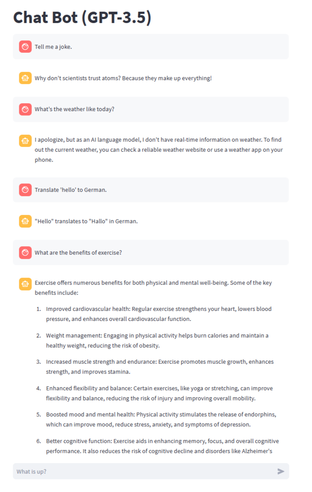

# Chat Bot (GPT-3.5) using Streamlit and OpenAI

This is a simple Python application that creates a chatbot powered by the GPT-3.5 model using the Streamlit framework for the user interface. The chatbot can engage in conversations and answer questions based on the user's input. 



## Prerequisites

Before you can run this chatbot, make sure you have the following prerequisites installed:

- Python
- Streamlit
- OpenAI Python SDK
- TOML library

You can install the required libraries using `pip`:

```bash
pip install streamlit openai toml
```

## Getting Started

1. Clone the repository or create a new project directory for this chatbot.

2. Inside your project directory, create a folder named `streamlit`. This folder will contain the `secrets.toml` file where you'll store your OpenAI API key.

3. Obtain an OpenAI API key and place it in the `secrets.toml` file as follows:

    ```toml
    # secrets.toml
    OPENAI_API_KEY = "YOUR_OPENAI_API_KEY_HERE"
    ```

4. Create a Python script (e.g., `app.py`) and paste the provided code into this script.

5. Run the chatbot application using the following command:

    ```bash
    streamlit run app.py
    ```

## How to Use

1. Upon running the application, a Streamlit interface will open in your web browser.

2. You will see a chat interface with a message input box labeled "What is up?"

3. Start a conversation by typing a message in the input box and pressing Enter.

4. The chatbot will respond to your message, and the conversation will continue. You can ask questions or have a general chat with the bot.

5. The conversation history will be displayed in the chat interface, with user and assistant messages shown.

6. The chatbot is powered by the GPT-3.5 model, and it can provide responses based on the context of the conversation.

7. To stop the chatbot, simply close the Streamlit interface or the terminal where it's running.

## Customization

- You can customize the chatbot's behavior by modifying the GPT-3.5 model settings or adding additional logic to handle specific user inputs.

- You can also add more conversation messages or prompts in the code to make the chatbot respond to various queries and topics.

Enjoy using your Chat Bot powered by GPT-3.5! Feel free to enhance and customize it further to suit your specific needs and requirements.
